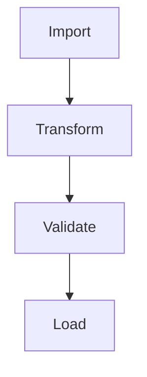

# Mermaid → PNG (Browser-Only)

Use the Mermaid Live Editor to export as **PNG/SVG**—no local installs.

1. Go to `https://mermaid.live/`
2. Paste your diagram.
3. `Export` → `PNG` (or `SVG` for slides).

## Example

