# Mermaid → PNG (Browser-Only)

Use the Mermaid Live Editor to export as **PNG/SVG**—no local installs.

1. Go to `https://mermaid.live/`
2. Paste your diagram.
3. `Export` → `PNG` (or `SVG` for slides).

## Example


## Local CLI (SVG/PNG via `mmdc`)

### Install (once)
```bash
npm install -g @mermaid-js/mermaid-cli
mmdc --version
```

## Project Layout

```bash
docs/
  diagrams/          # .mmd sources (not published)
  assets/diagrams/   # rendered .svg/.png used in pages
```

## Export one

```bash
mmdc -i docs/diagrams/close-process.mmd -o docs/assets/diagrams/close-process.svg -b transparent -t neutral
mmdc -i docs/diagrams/close-process.mmd -o docs/assets/diagrams/close-process.png -s 2
```

## Batch export

### Bash

```bash
for f in docs/diagrams/*.mmd; do
  base=$(basename "$f" .mmd)
  mmdc -i "$f" -o "docs/assets/diagrams/$base.svg" -b transparent -t neutral
done
```

### PowerShell

```powershell
Get-ChildItem docs/diagrams -Filter *.mmd | ForEach-Object {
  $base = [IO.Path]::GetFileNameWithoutExtension($_.FullName)
  mmdc -i $_.FullName -o "docs/assets/diagrams/$base.svg" -b transparent -t neutral
}
```

## Use in pages

```markdown

```

**Tips**: prefer SVG for the site, PNG for slides, themes via `-t default|neutral|forest|dark`.