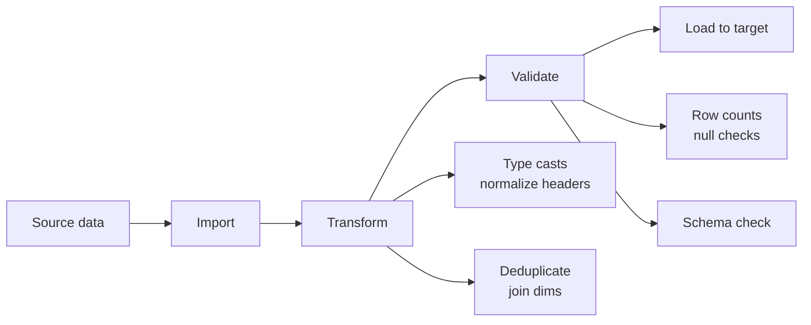
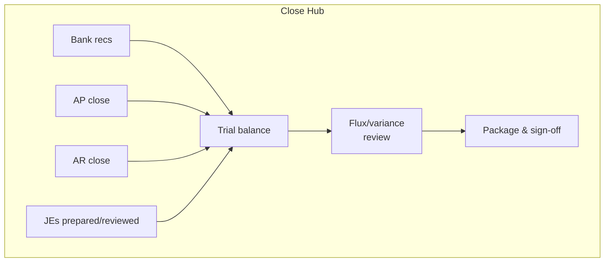
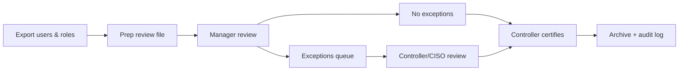

# Mermaid Gallery

Quick, reusable diagrams for finance ops.

## ETL pipeline

```mermaid
flowchart LR
  A["Source data"] --> B["Import"]
  B --> C["Transform"]
  C --> D["Validate"]
  D --> E["Load to target"]
  C --> C1["Type casts<br/>normalize headers"]
  C --> C2["Deduplicate<br/>join dims"]
  D --> D1["Row counts<br/>null checks"]
  D --> D2["Schema check"]
```

## Close Hub Overview

```mermaid
flowchart TD
  subgraph S["Close Hub"]
    R["Bank recs"] --> TB["Trial balance"]
    AP["AP close"] --> TB
    AR["AR close"] --> TB
    JE["JEs prepared/reviewed"] --> TB
    TB --> FL["Flux/variance<br/>review"]
    FL --> PK["Package & sign-off"]
  end
```

## Ramp Quarterly Access Review (QAR)

```mermaid
flowchart LR
  X["Export users & roles"] --> Y["Prep review file"]
  Y --> M["Manager review"]
  M --> E["Exceptions queue"]
  M --> OK["No exceptions"]
  E --> C["Controller/CISO review"]
  OK --> Cert["Controller certifies"]
  C --> Cert
  Cert --> Arc["Archive + audit log"]
```
