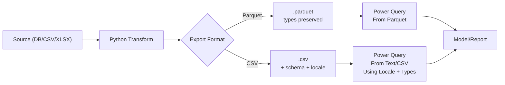

# Power Query Hand-off Patterns

> Clean, predictable transfers from Python/SQL into Excel Power Query (PQ).

!!! tip "TL;DR"
    - Prefer **Parquet** when possible: better types, fewer surprises.  
    - If using **CSV**, control the schema (dtypes, date formats, locale) and document it.

---

## Goals
- Preserve data types (dates, numbers, booleans, text) across the Python → Excel PQ boundary.
- Avoid silent type drift (e.g., 0123 → 123, True/False → text).
- Provide copy-paste recipes for both CSV and Parquet workflows.

## Prerequisites
- Python 3.11+ with pandas (and pyarrow for Parquet).
- Excel with Power Query (Get & Transform).  
- A consistent standard schema for your exports.

---

## Recommended workflow



---

## Standard schema (example)

Use a dict to lock types. Adjust to your domain.

```python
SCHEMA = {
    "txn_id": "string",
    "account_id": "string",
    "merchant": "string",
    "memo": "string",
    "category": "string",
    "currency": "string",
    "amount": "float64",
}

DATE_COLS = ["txn_date", "posted_date"]
BOOL_COLS = ["is_recurring", "is_refund"]
ORDER = ["txn_id", "txn_date", "posted_date", "account_id", "merchant",
         "memo", "category", "currency", "amount", "is_recurring", "is_refund"]
```

---

## Python → Parquet (preferred)

```python
import pandas as pd

def export_parquet(df: pd.DataFrame, path: str) -> None:
    # Normalize headers
    df.columns = (df.columns
                  .str.strip()
                  .str.lower()
                  .str.replace(r"[^a-z0-9]+", "_", regex=True))

    # Enforce schema
    for col, typ in SCHEMA.items():
        if col not in df.columns:
            df[col] = pd.Series([None] * len(df), dtype="string" if typ == "string" else typ)
        else:
            df[col] = df[col].astype(typ)

    # Dates: parse & drop timezone so Excel shows the expected day
    for c in DATE_COLS:
        if c in df.columns:
            df[c] = pd.to_datetime(df[c], errors="coerce").dt.tz_localize(None)

    # Booleans
    for c in BOOL_COLS:
        if c in df.columns:
            df[c] = df[c].astype("boolean")

    # Column order (optional)
    present = [c for c in ORDER if c in df.columns]
    df = df[present + [c for c in df.columns if c not in present]]

    # Write Parquet (pyarrow engine)
    df.to_parquet(path, index=False)
```

**Power Query steps (Excel):**
1. Data → Get Data → From File → From Parquet.
2. Browse to your .parquet export and Load.  
   Power Query will infer logical/number/date correctly from Parquet metadata.

---

## Python → CSV (controlled)

```python
import pandas as pd

def export_csv(df: pd.DataFrame, path: str) -> None:
    # Same normalization & typing as Parquet path above...
    # (call the same functions or reuse code)

    # Date formatting for CSV: ISO date only (prevents midnight shifts)
    for c in [col for col in DATE_COLS if col in df.columns]:
        df[c] = pd.to_datetime(df[c], errors="coerce").dt.strftime("%Y-%m-%d")

    df.to_csv(
        path,
        index=False,
        encoding="utf-8",
        lineterminator="\n",
    )
```

**Power Query steps (Excel) for CSV:**
1. Data → Get Data → From Text/CSV → pick your file.  
2. In the preview dialog, choose File Origin/Delimiter if needed. Click Transform Data.  
3. In PQ:
   - Home → Use First Row as Headers (if needed).
   - Transform → Detect Data Type (avoid); instead set types explicitly:
     - Transform → Data Type → Using Locale…
       - For amount: Decimal Number, Locale: English (United States).
       - For dates: Date.
       - For booleans: set to True/False (logical) or convert 0/1 → logical via Replace Values then type to True/False.
   - If IDs like 00123 must keep leading zeros, set those columns to Text (don’t convert to number).

---

## Power Query M examples

**CSV with locale + types**

```powerquery
let
  Source = Csv.Document(
    File.Contents("C:\path\export.csv"),
    [Delimiter=",", Columns=11, Encoding=65001, QuoteStyle=QuoteStyle.Csv]
  ),
  Promote = Table.PromoteHeaders(Source, [PromoteAllScalars=true]),
  // Set types with explicit locale to control decimal/thousand separators
  Types = Table.TransformColumnTypes(
    Promote,
    {
      {"txn_id", type text},
      {"txn_date", type date},
      {"posted_date", type date},
      {"account_id", type text},
      {"merchant", type text},
      {"memo", type text},
      {"category", type text},
      {"currency", type text},
      {"amount", type number},
      {"is_recurring", type logical},
      {"is_refund", type logical}
    },
    "en-US"
  )
in
  Types
```

**Parquet**

```powerquery
let
  Source = Parquet.Document(File.Contents("C:\path\export.parquet")),
  // Usually already typed; add explicit casts if you want hard guarantees:
  Typed = Table.TransformColumnTypes(
    Source,
    {
      {"txn_date", type date},
      {"posted_date", type date},
      {"amount", type number}
    }
  )
in
  Typed
```

---

## Pitfalls & fixes

- **Datetime shifts (TZ)**  
  *Symptom:* dates appear one day off in Excel.  
  *Fix (Python):*
  ```python
  df[c] = pd.to_datetime(df[c], errors="coerce").dt.tz_localize(None)
  ```
- **Leading zeros lost**  
  *Symptom:* 00123 becomes 123.  
  *Fix:* keep IDs as text in Python (dtype="string") and set Text in PQ.
- **Decimal or thousand separators misread**  
  *Symptom:* 1,234.56 becomes 123456 or text.  
  *Fix:* In PQ, use Using Locale → Decimal Number with en-US.
- **Booleans become text**  
  *Symptom:* True/False shows as "True"/"False".  
  *Fix:* In PQ, set type to True/False. From Python, use pandas boolean dtype.
- **CSV encoding issues**  
  *Symptom:* special characters garbled.  
  *Fix:* write encoding="utf-8"; in PQ, encoding 65001 (UTF-8).

---

## Verification checklist (1 min)

- Row count matches between Python and PQ.  
- Key columns have expected types in PQ (Date, Decimal Number, True/False, Text).  
- Spot-check a few rows for:
  - Leading zeros on IDs
  - Amounts with decimals
  - Dates matching originals
  - Booleans as checkboxes

---

## Deliverables (when you close this issue)
- This page: docs/how-to/power-query-handoff.md
- (Optional) Sample files in /examples/:
  - examples/pq_handoff_sample.parquet
  - examples/pq_handoff_sample.csv
- Link this page from the How-To nav in mkdocs.yml:
  ```yaml
  nav:
    - Home: index.md
    - How-To:
        - Power Query Hand-off Patterns: how-to/power-query-handoff.md
        - Pandas I/O Cheats: how-to/pandas-io.md
  ```

---

## FAQ

**Why not always use Parquet?**  
Parquet is best for fidelity and size, but some teams still need CSV for hand edits or legacy tools. This guide keeps CSV safe when required.

**Do I need utf-8-sig?**  
Usually no. Use utf-8. If another system demands BOM, write encoding="utf-8-sig" and set PQ encoding to 65001.

**Can Power Query read Parquet on SharePoint/OneDrive?**  
Yes—use the Parquet connector with the file path/URL your tenant supports, or land the file locally/SharePoint and select it via Get Data → From Parquet.

---

<a href="../examples/pq_handoff_sample.csv" download>Download CSV</a><br/>
<a href="../examples/pq_handoff_sample.parquet" download>Download Parquet</a>

*Last updated:* {{ date | strftime('%Y-%m-%d') }}
